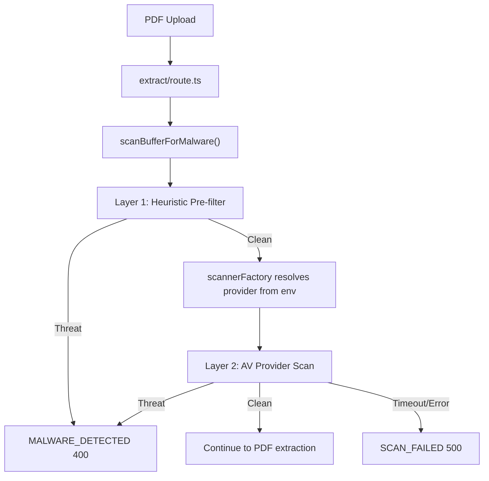

# AV Scanner for PDF Uploads

**Audience:** Developers and operators who need to understand how PDF upload malware scanning works.  
**Last Updated:** February 2026

## Overview

Before we extract text from an uploaded PDF (for plan-from-PDF flows), we run the file through a two-layer malware scan. This follows OWASP guidance to use AV/sandbox as defense-in-depth for file uploads. The pipeline is **fail-closed**: any scan error or timeout blocks extraction and returns an error to the user.

The only public API is `scanBufferForMalware(buffer)` in `src/lib/security/malware-scanner.ts`. The extraction route calls it and does not need to know about heuristics, providers, or env configuration—all of that is encapsulated behind that function.

---

## Architecture

**Principle:** The extraction route does not change. `scanBufferForMalware` is the single entry point; all scanning logic (heuristics + optional external AV) lives behind it.

---

## Two-Layer Flow

### Layer 1: Heuristic pre-filter (always runs)

- **Location:** `src/lib/security/heuristic-scanner.ts`
- **Purpose:** Fast, in-process checks with no network calls.
- **Checks:**
  - EICAR test signature (standard AV test file).
  - PDFs that contain JavaScript/Launch/JS name tokens (common exploit vector).
- If Layer 1 finds a threat, we return immediately with `{ clean: false, threat: "..." }`. The external AV provider is **not** called.

### Layer 2: External AV provider (when configured)

- **Location:** `src/lib/security/providers/metadefender.ts` (current implementation).
- **Purpose:** Multi-engine malware detection via OPSWAT MetaDefender Cloud.
- **When it runs:** Only if Layer 1 passes and `AV_PROVIDER` is set to a non-`none` value (e.g. `metadefender`).
- **Behavior:** POSTs the file to MetaDefender, polls for scan completion, then maps the verdict to our `ScanVerdict` type. Timeouts and API errors cause the function to throw; the route catches that and returns `SCAN_FAILED` (500), so we never proceed to extraction on scan failure.

---

## Where It Runs in the Request

The PDF extraction route is:

`POST /api/v1/plans/from-pdf/extract`

Order of operations in that route:

1. Auth and rate limiting.
2. FormData validation (file present, type `application/pdf`, size limits).
3. Magic bytes check (`%PDF-`).
4. **Malware scan** — `scanBufferForMalware(buffer)` (heuristic then optional provider).
5. On clean: `extractTextFromPdf(buffer)`, then tier validation and response.

So the AV scan runs **after** basic validation and **before** any PDF parsing. Infected or unscanable files never reach the parser.

---

## Configuration

All AV-related settings come from `avScannerEnv` in `src/lib/config/env.ts`:

| Env variable               | Purpose                                 | Required in production          |
| -------------------------- | --------------------------------------- | ------------------------------- |
| `AV_PROVIDER`              | `metadefender` or `none`                | Yes (must not be `none`)        |
| `AV_METADEFENDER_API_KEY`  | API key for MetaDefender Cloud          | When provider is `metadefender` |
| `AV_METADEFENDER_BASE_URL` | MetaDefender API base URL               | No (defaults to US endpoint)    |
| `AV_SCAN_TIMEOUT_MS`       | End-to-end scan timeout in milliseconds | No (default 30_000)             |

- **Development / tests:** `AV_PROVIDER=none` is valid; only heuristics run. No API key needed.
- **Production:** `AV_PROVIDER` must be set (e.g. `metadefender`). If it is `metadefender`, `AV_METADEFENDER_API_KEY` must be set or the app throws at first scan.

See `docs/rules/development/environment.md` for the full AV variable table and the Vercel rollout runbook.

---

## File Layout

| File                                         | Responsibility                                                                                                            |
| -------------------------------------------- | ------------------------------------------------------------------------------------------------------------------------- |
| `src/lib/security/scanner.types.ts`          | `ScanVerdict` and `ScanProvider` interface shared by all scanners.                                                        |
| `src/lib/security/heuristic-scanner.ts`      | EICAR + PDF JavaScript heuristics; implements `ScanProvider`.                                                             |
| `src/lib/security/providers/metadefender.ts` | MetaDefender Cloud REST adapter: submit file, poll for result, timeout handling.                                          |
| `src/lib/security/scanner-factory.ts`        | Resolves `AV_PROVIDER` from env and returns the appropriate `ScanProvider` (or `null` for heuristics-only).               |
| `src/lib/security/malware-scanner.ts`        | Orchestrator: runs heuristic scan, then optional provider scan; logs latency and verdict; exposes `scanBufferForMalware`. |

The extraction route imports only `scanBufferForMalware` (and the public type `MalwareScanResult`) from `malware-scanner.ts`.

---

## Provider Strategy

- **Current production option:** OPSWAT MetaDefender Cloud (free tier: 1,000 scans/day, 10 engines, 140MB file limit). Configure via `AV_PROVIDER=metadefender` and `AV_METADEFENDER_API_KEY`.
- **Scaling later:** Add another adapter (e.g. ClamAV REST) under `src/lib/security/providers/`, implement `ScanProvider`, and add a branch in `scanner-factory.ts` for a new `AV_PROVIDER` value. No change to the orchestrator or the route.
- **Rollback:** Set `AV_PROVIDER=none` in the environment to fall back to heuristics-only (no deploy required). Use only for short-term mitigation; production should run a real AV provider.

---

## Fail-closed behavior

- If the heuristic scan throws, the route catches it and returns **500** with code `SCAN_FAILED`.
- If the external provider throws (timeout, API error, malformed response), the route catches it and returns **500** with code `SCAN_FAILED`.
- We do **not** proceed to PDF extraction when the scan fails. User sees a generic “Unable to verify file security” message.

---

## Related docs

- **Environment and rollout:** `docs/rules/development/environment.md` (AV variables, Vercel runbook).
- **Plan generation (broader flow):** `docs/context/architecture/plan-generation-architecture.md`.
