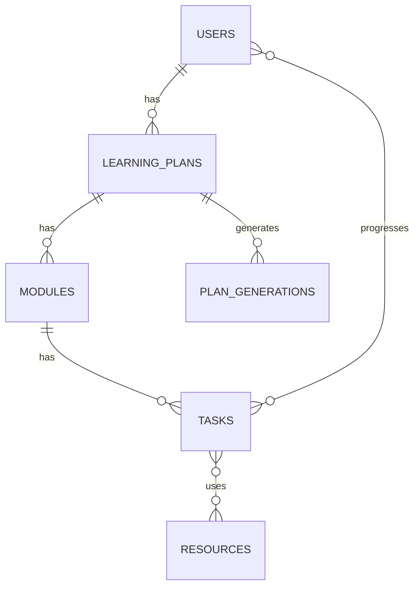

# Database Schema Outline (MVP)

Scope: Core plan creation, modules, tasks, resources, per-user progress, and plan regeneration history. Exports/integrations (Notion/Google) are explicitly deferred for a later phase.

## Enums

- skill_level: beginner | intermediate | advanced
- learning_style: reading | video | practice | mixed
- resource_type: youtube | article | course | doc | other
- progress_status: not_started | in_progress | completed

## Tables

### 1) users

- id: uuid, pk, default gen_random_uuid()
- clerk_user_id: text, not null, unique
- email: text, not null, unique
- name: text, nullable
- subscription_tier: text/enum, nullable (e.g., free, pro)
- created_at: timestamptz, not null, default now()
- updated_at: timestamptz, not null, default now()

**Constraints/Indexes:**

- unique(clerk_user_id), unique(email)
  Notes:
- Keep id as the internal PK (do not use clerk_user_id as PK). Emails can change—ensure app logic updates email on profile changes.

**RLS policies:**

- Select: A user may read only their own row (users.id equals the current authenticated user’s id). Admin/service role may read all.
- Insert: Performed by the signup/system service. When allowed, the row’s id must equal the current user id; clerk_user_id and email must come from a verified identity.
- Update: A user may update only their own row. Restrict updates to profile fields (e.g., name); identifiers like email, clerk_user_id, and subscription_tier are system-managed.
- Delete: System/service role only.

### 2) learning_plans

- id: uuid, pk, default gen_random_uuid()
- user_id: uuid, fk → users.id, not null ON DELETE CASCADE
- topic: text, not null
- skill_level: enum(skill_level), not null
- weekly_hours: int, not null, CHECK (weekly_hours >= 0)
- learning_style: enum(learning_style), not null
- start_date: date, nullable
- deadline_date: date, nullable
- visibility: text/enum, not null, default 'private' (private | public)
- origin: text/enum, not null, default 'ai' (ai | template | manual)
- created_at: timestamptz, not null, default now()
- updated_at: timestamptz, not null, default now()

**Indexes:**

- idx_learning_plans_user_id
- (optional) full-text or trigram index on topic for search
  Notes:
- start_date and deadline_date enable future pacing/scheduling; they can be null initially.

**RLS policies:**

- Select: The owner may read their own plans. Any authenticated user may read plans where visibility = 'public'. Admin/service role may read all.
- Insert: An authenticated user may create a plan only if user_id equals their id.
- Update: Only the owner may update. Prevent changing user_id; allow toggling visibility and editing plan fields.
- Delete: Only the owner may delete (cascades to modules/tasks/etc.).

### 3) modules

- id: uuid, pk, default gen_random_uuid()
- plan_id: uuid, fk → learning_plans.id, not null ON DELETE CASCADE
- order: int, not null, CHECK (order >= 1) — sequence within plan
- title: text, not null
- description: text, nullable
- estimated_minutes: int, not null, CHECK (estimated_minutes >= 0)
- created_at: timestamptz, not null, default now()
- updated_at: timestamptz, not null, default now()

**Constraints/Indexes:**

- unique(plan_id, order)
- idx_modules_plan_id
- idx_modules_plan_id_order

**RLS policies:**

- Select: Allowed if the current user can read the parent plan (owner or plan.visibility = 'public').
- Insert: Only the owner of the parent plan may insert modules.
- Update: Only the owner of the parent plan may update modules.
- Delete: Only the owner of the parent plan may delete modules.

### 4) tasks

- id: uuid, pk, default gen_random_uuid()
- module_id: uuid, fk → modules.id, not null ON DELETE CASCADE
- order: int, not null, CHECK (order >= 1) — sequence within module
- title: text, not null
- description: text, nullable
- estimated_minutes: int, not null, CHECK (estimated_minutes >= 0)
- created_at: timestamptz, not null, default now()
- updated_at: timestamptz, not null, default now()

**Constraints/Indexes:**

- unique(module_id, order)
- idx_tasks_module_id
- idx_tasks_module_id_order
  Rationale:
- Daily/session-level tasks with time estimates support plan preview, progress tracking, and future calendar sync.

**RLS policies:**

- Select: Allowed if the current user can read the parent plan (owner or plan.visibility = 'public').
- Insert: Only the owner of the parent plan may insert tasks.
- Update: Only the owner of the parent plan may update tasks.
- Delete: Only the owner of the parent plan may delete tasks.

### 5) resources (global catalog)

- id: uuid, pk, default gen_random_uuid()
- type: enum(resource_type), not null
- title: text, not null
- url: text, not null
- domain: text, nullable (parsed from URL)
- author: text, nullable
- duration_minutes: int, nullable, CHECK (duration_minutes >= 0)
- cost_cents: int, nullable, CHECK (cost_cents >= 0)
- currency: text(3), nullable (ISO code)
- tags: text[] (optional) or model as a separate tagging relation
- created_at: timestamptz, not null, default now()

**Constraints/Indexes:**

- unique(url)
- idx_resources_type
  Notes:
- A shared catalog prevents duplication across modules/tasks/plans.

**RLS policies:**

- Select: Readable by all authenticated users (optionally by anonymous users if exposed publicly).
- Insert/Update/Delete: System/admin only. End-users do not modify the global catalog in MVP.

### 6) task_resources (join: tasks ↔ resources)

- id: uuid, pk, default gen_random_uuid()
- task_id: uuid, fk → tasks.id, not null ON DELETE CASCADE
- resource_id: uuid, fk → resources.id, not null ON DELETE CASCADE
- order: int, not null, CHECK (order >= 1) — display ordering per task
- notes: text, nullable
- created_at: timestamptz, not null, default now()

**Constraints/Indexes:**

- unique(task_id, resource_id)
- idx_task_resources_task_id
- idx_task_resources_resource_id

**RLS policies:**

- Select: Allowed if the current user can read the parent task’s plan (owner or plan.visibility = 'public').
- Insert/Update/Delete: Only the owner of the parent plan may manage task-resource links.

### 7) task_progress (per-user progress)

- id: uuid, pk, default gen_random_uuid()
- task_id: uuid, fk → tasks.id, not null ON DELETE CASCADE
- user_id: uuid, fk → users.id, not null ON DELETE CASCADE
- status: enum(progress_status), not null, default 'not_started'
- completed_at: timestamptz, nullable
- updated_at: timestamptz, not null, default now()
- created_at: timestamptz, not null, default now()

**Constraints/Indexes:**

- unique(task_id, user_id)
- idx_task_progress_user_id
- idx_task_progress_task_id
  Notes:
- Module/plan completion is derivable by aggregating a user’s task_progress within the module/plan.

**RLS policies:**

- Select: A user may read only their own progress rows (task_progress.user_id equals the current user’s id).
- Insert: A user may create progress only for themselves and only for tasks they can read (owner or plan.visibility = 'public').
- Update: A user may update only their own progress rows; forbid changing task_id or user_id on update.
- Delete: A user may delete only their own progress rows. Admin/service role may manage all.

### 8) plan_generations (regeneration traceability)

- id: uuid, pk, default gen_random_uuid()
- plan_id: uuid, fk → learning_plans.id, not null ON DELETE CASCADE
- model: text, not null (e.g., gpt-5)
- prompt: jsonb or text, not null (inputs)
- parameters: jsonb, nullable (e.g., temperature)
- output_summary: jsonb, nullable (high-level summary or counts)
- created_at: timestamptz, not null, default now()

**Indexes:**

- idx_plan_generations_plan_id
  Notes:
- Keeps a history of generations for debugging, analytics, and “regenerate” flows.

**RLS policies:**

- Select: Only the owner of the parent plan may read generation records.
- Insert: Performed by the app when (re)generating a plan. Allow only the owner (or service role) to insert rows for their plan.
- Update/Delete: Owner or service role only (generally updates are uncommon; treat records as append-only).

## ERD (Entity-Relationship Diagram)

High-level relationships; M—N edges are implemented via task_resources and task_progress join tables.

## Relationships summary

- users 1—\* learning_plans
- learning_plans 1—\* modules
- modules 1—\* tasks
- resources _—_ tasks via task_resources
- users _—_ tasks via task_progress
- learning_plans 1—\* plan_generations

## Index summary (for common query patterns)

- learning_plans: (user_id), optionally topic search index
- modules: (plan_id), (plan_id, order)
- tasks: (module_id), (module_id, order)
- task_progress: (user_id), (task_id)
- resources: (url unique), (type)
- task_resources: (task_id), (resource_id)
- plan_generations: (plan_id)

## Constraints & integrity

- Use timestamptz consistently with default now() for created_at; maintain updated_at via triggers or app logic.
- Enforce ordering uniqueness with unique(plan_id, order) and unique(module_id, order).
- CHECK constraints for non-negative integers: weekly_hours, estimated_minutes, duration_minutes, cost_cents.
- Foreign keys should generally use ON DELETE CASCADE to prevent orphaned rows.
- Define enums in Postgres (or via Drizzle pgEnum) for skill_level, learning_style, resource_type, progress_status.

## Client mapping notes

- UI progress and status badges are derived from `task_progress` aggregates; modules are considered complete when all child tasks are completed.
- Dashboard `totalWeeks` uses the number of modules ordered by `modules.order`. `currentWeek` advances when a module is fully completed (all tasks completed) and otherwise stays at the next module index.
- Plan completion percentage is `(completed task count) / (total task count)`; task durations are stored in minutes and converted to hours for display.
- Weekly availability is captured as an integer `weekly_hours`. UI ranges map to representative integers: `1-2 → 2`, `3-5 → 5`, `6-10 → 10`, `11-15 → 15`, `16-20 → 20`, `20+ → 25`.
- When onboarding collects optional notes they are currently used for AI prompt context only; persistence will require adding a `notes` column to `learning_plans`.

## Notes & future-ready considerations

- Exports/integrations (Notion/Google) are intentionally excluded at this stage.
- If you later allow anonymous “Try Without Account,” consider adding guest_sessions and allowing learning_plans.user_id to be nullable with a migration path to a real user on sign-up.
- Subscriptions (now vs later):
  - Now (MVP, no Stripe):
    - Do not add billing tables; gate features in application logic (for example, cap the number of learning_plans per user).
    - Optional: keep users.subscription_tier enum('free','pro') default 'free' as a manual toggle for QA/beta; treat it as advisory until Stripe is integrated.
  - Later (Stripe integration):
    - Add billing_customers: user_id fk, stripe_customer_id UNIQUE, created_at.
    - Add subscriptions: user_id fk, stripe_subscription_id UNIQUE, price_id, status, current_period_end, cancel_at_period_end, created_at, updated_at.
    - Add webhook_events: event_id UNIQUE, type, payload JSONB, processed_at; use for idempotency and auditing.
    - Drive entitlements from active subscriptions; optionally cache a derived subscription_tier on users for fast reads.
