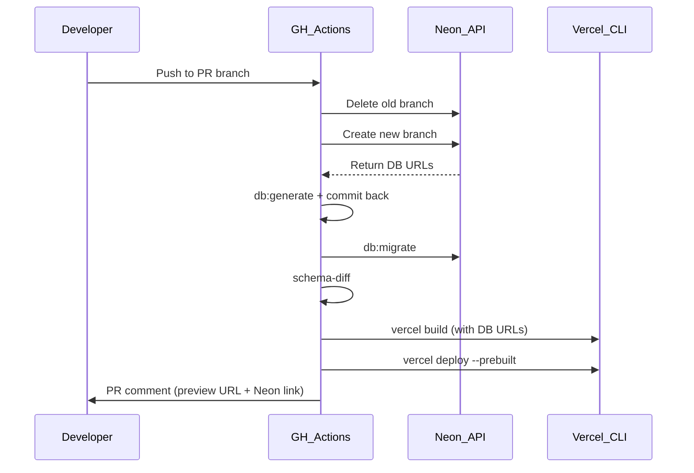
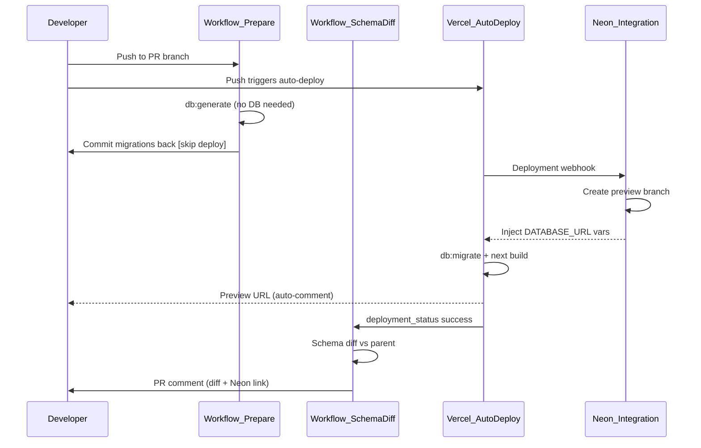

# Migrate Preview Deploys to Neon/Vercel Integration

## Current Flow (what we're replacing)



## New Flow



Key difference: GH Actions no longer creates Neon branches or deploys to Vercel. The integration handles both. GH Actions is reduced to migration file generation and schema diff reporting.

---

## 1. Code Changes -- Support Integration Env Var Names

The Neon integration injects `DATABASE_URL_UNPOOLED` (direct connection), but the app expects `DATABASE_URL_NON_POOLING`. Add a fallback chain so both names work.

### [drizzle.config.ts](drizzle.config.ts) (line 13-14)

```typescript
// Before
const databaseUrl =
  process.env.DATABASE_URL_NON_POOLING || process.env.DATABASE_URL;

// After
const databaseUrl =
  process.env.DATABASE_URL_NON_POOLING ||
  process.env.DATABASE_URL_UNPOOLED ||
  process.env.DATABASE_URL;
```

### [src/lib/config/env.ts](src/lib/config/env.ts) (line 285-286)

```typescript
// Before
get nonPoolingUrl(): string {
  return getServerOptional('DATABASE_URL_NON_POOLING') ?? this.url;
},

// After
get nonPoolingUrl(): string {
  return (
    getServerOptional('DATABASE_URL_NON_POOLING') ??
    getServerOptional('DATABASE_URL_UNPOOLED') ??
    this.url
  );
},
```

### [src/lib/db/neon-config.ts](src/lib/db/neon-config.ts) (line 33)

```typescript
// Before
process.env.DATABASE_URL_NON_POOLING || process.env.DATABASE_URL || '';

// After
process.env.DATABASE_URL_NON_POOLING ||
  process.env.DATABASE_URL_UNPOOLED ||
  process.env.DATABASE_URL ||
  '';
```

---

## 2. Vercel Dashboard Configuration (manual steps)

These must be done in the Vercel dashboard before merging:

- **Enable auto-deploy for Preview**: Project Settings > Git > ensure preview deployments are on
- **Override build command for Preview environment**: Set to `pnpm db:generate && pnpm db:migrate && next build --turbopack`
  - `db:generate` is a safety net if migration files haven't been committed yet
  - `db:migrate` applies pending migrations to the integration-created preview branch
  - `next build` builds the app (lazy DB init means build succeeds; DB is only accessed at runtime)
- **Configure Ignored Build Step**: Set to a custom command that skips builds for migration-commit pushes:

```bash
  if git log -1 --pretty=%B | grep -qF '[skip deploy]'; then exit 0; fi; exit 1


```

(exit 0 = skip build, exit 1 = proceed)

- **Verify preview env vars exist**: `NEON_AUTH_COOKIE_SECRET`, `OPENROUTER_API_KEY`, `OAUTH_ENCRYPTION_KEY`, and any other non-DB vars your app needs. DB vars (`DATABASE_URL`, `DATABASE_URL_UNPOOLED`, `NEON_AUTH_BASE_URL`) are auto-injected by the integration.

---

## 3. Replace `deploy-preview.yml` with `preview-db-migrations.yml`

Rewrite [.github/workflows/deploy-preview.yml](.github/workflows/deploy-preview.yml) to be a lightweight migration-generation workflow (`preview-db-migrations.yml`).

**Keeps**: path filtering, concurrency group, checkout, install deps, `db:generate`, commit-back logic.

**Removes**: all Neon branch create/delete steps, all Vercel build/deploy steps, preview URL PR comment.

**Changes**: Uses a dummy `DATABASE_URL` for `db:generate` (it only reads schema files, never connects). Commit message uses `[skip deploy]` to prevent Vercel re-triggering.

Outline of new workflow:

```yaml
name: Preview Migrations
on:
  pull_request:
    types: [opened, synchronize, reopened]
    branches: [develop, main]
    paths:
      [
        src/**,
        src/lib/db/schema/**,
        src/lib/db/migrations/**,
        public/**,
        drizzle.config.ts,
        package.json,
        pnpm-lock.yaml,
        next.config.*,
        tsconfig.json,
        .github/workflows/preview-db-migrations.yml,
      ]

concurrency:
  group: preview-migrations-${{ github.event.number }}
  cancel-in-progress: true

jobs:
  generate-migrations:
    runs-on: ubuntu-latest
    steps:
      - Checkout (ref: github.head_ref)
      - Install pnpm + Node.js + deps
      - Run pnpm db:generate (env: DATABASE_URL=postgresql://placeholder@localhost/placeholder)
      - Commit + push if changes (message includes [skip deploy])
```

Secrets needed: Only `GITHUB_TOKEN` (no Neon or Vercel secrets).

---

## 4. Add `preview-schema-diff.yml` (new workflow)

A new event-driven workflow that fires when a Vercel preview deployment succeeds, so the Neon branch exists and has migrations applied.

```yaml
name: Preview Schema Diff
on:
  deployment_status:

env:
  NEON_API_KEY: ${{ secrets.NEON_API_KEY }}
  NEON_PROJECT_ID: ${{ secrets.NEON_PROJECT_ID }}

jobs:
  schema-diff:
    if: >
      github.event.deployment_status.state == 'success' &&
      github.event.deployment.environment == 'Preview'
    runs-on: ubuntu-latest
    steps:
      - Checkout
      - Resolve PR number from deployment ref (gh pr list --head <ref>)
      - Run neondatabase/schema-diff-action@v1
        compare_branch: preview/${{ github.event.deployment.ref }}
      - Post PR comment with schema diff + Neon console link
```

**Why `deployment_status`?** It's event-driven (no polling, no wasted CI minutes). Vercel sends GitHub deployment statuses automatically. The workflow only runs once the build (including `db:migrate`) has completed.

Branch naming is confirmed as `preview/<git-branch>`, so `compare_branch: preview/${{ github.event.deployment.ref }}` is the expected value.

---

## 5. Remove `cleanup-preview.yml`

Delete [.github/workflows/cleanup-preview.yml](.github/workflows/cleanup-preview.yml). The Neon-Managed integration automatically deletes preview branches when the corresponding git branch is deleted ("Automatically delete obsolete Neon branches").

---

## 6. Update Documentation

Update [docs/context/ci/branching-strategy.md](docs/context/ci/branching-strategy.md):

- Replace section 3 ("deploy-preview.yml") to describe the new two-workflow approach
- Replace section 5 ("cleanup-preview.yml") to note integration handles cleanup
- Update required secrets list (most Neon/Vercel deploy secrets no longer needed for preview)

---

## Risks and Mitigations

| Risk                                                       | Mitigation                                                                        |
| ---------------------------------------------------------- | --------------------------------------------------------------------------------- |
| `DATABASE_URL_UNPOOLED` naming mismatch                    | Code changes in step 1 add fallback chain                                         |
| `next build` fails without DB at build time                | Lazy proxy pattern in `service-role.ts` defers connection; no static pages hit DB |
| Migration commit re-triggers Vercel deploy                 | Ignored Build Step skips `[skip deploy]` commits                                  |
| Schema diff runs before migrations complete                | `deployment_status` only fires after build succeeds                               |
| Two Vercel deploys per push (original + migration commit)  | Migration commit is skipped by Ignored Build Step; only one deploy runs           |
| Integration branch naming convention changes in the future | Update `compare_branch` in `preview-schema-diff.yml` if Neon integration changes  |

## Rollback Plan

If something goes wrong after merging:

1. Disable Vercel auto-deploy for preview
2. Restore the original `deploy-preview.yml` and `cleanup-preview.yml` from git history
3. The code changes (env var fallbacks) are additive and harmless to keep
